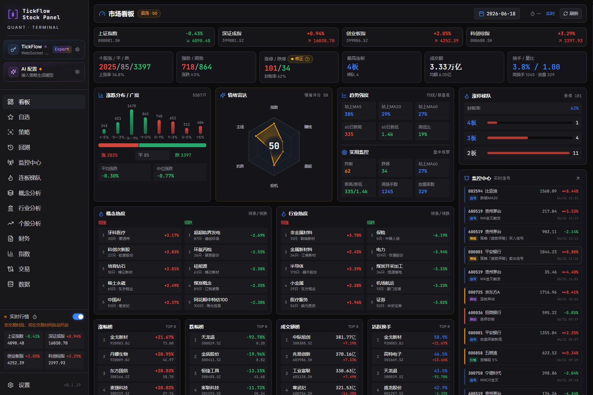
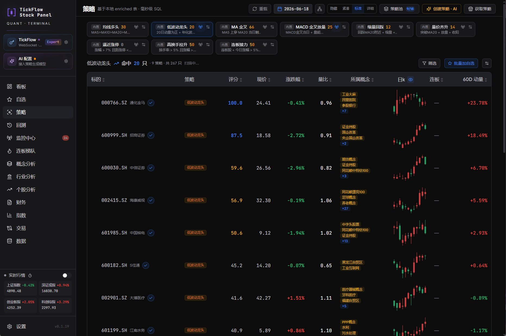
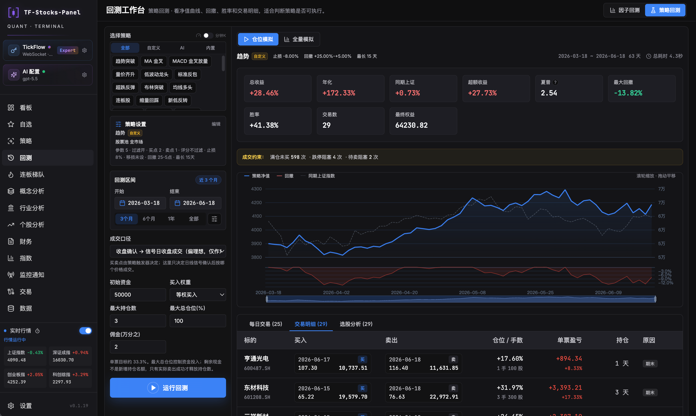
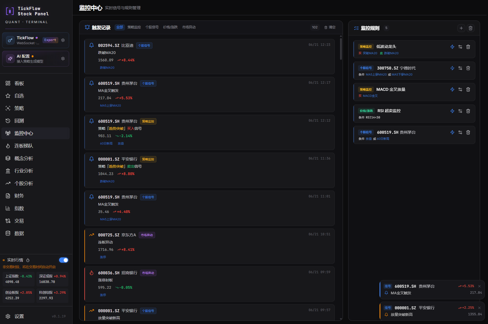
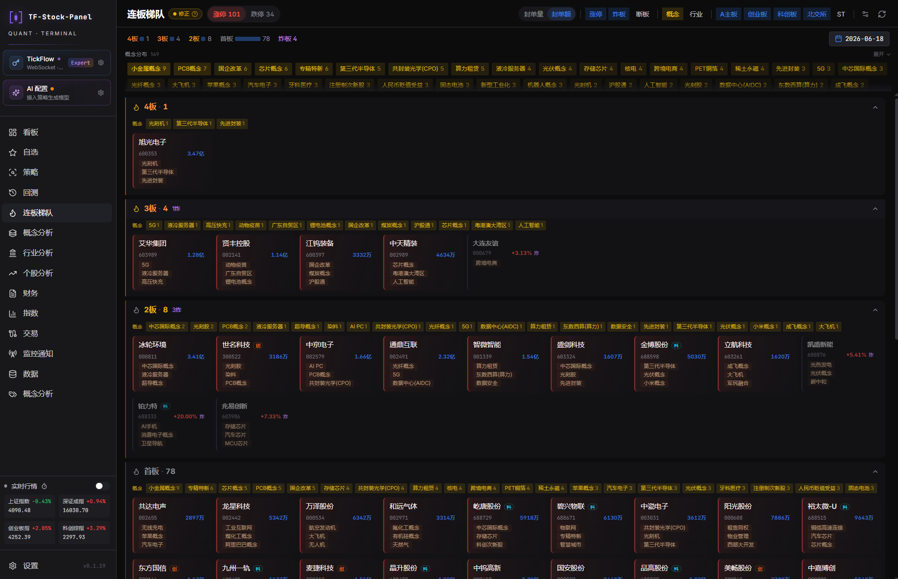
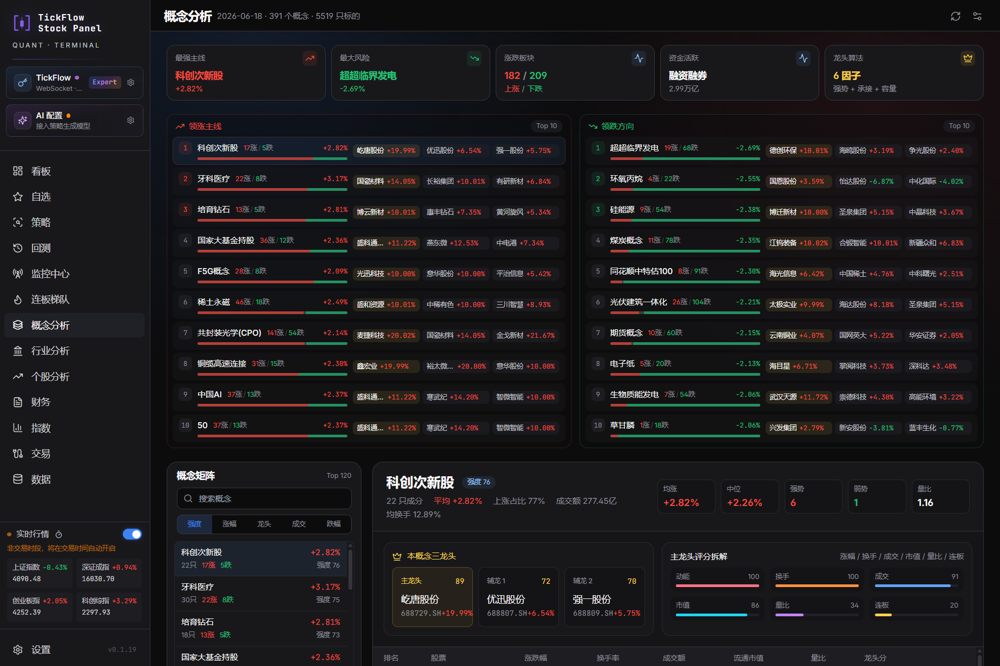

<div align="center">

# 📈 A股智能量化工作台

**自托管、零运维的 A 股「选股 + 监控 + 回测」量化工作台**

[](./LICENSE)
[](https://www.python.org/)
[](https://react.dev/)
[](https://tickflow.org/auth/register?ref=V3KDKGXPEA)
[](./Dockerfile)
[](https://github.com/shy3130/tickflow-stock-panel/stargazers)

**[快速开始](#-快速开始)** · **[核心功能](#-核心功能)** · **[配置](#️-配置)** · **[路线图](#-路线图)**

</div>

- 🆓 **开箱即用** — 留空 Key 即进 None 模式,历史日 K 免费体验,**无需付费**
- 🏠 **自托管零运维** — Docker 单容器部署,数据完全掌握在自己手里
- 🔍 **三位一体** — 选股(20 内置策略)+ 实时监控 + 向量化回测,Polars 毫秒级扫描全 A 股
- 🤖 **AI 加持** — 一句话生成策略代码,任意 OpenAI 兼容接口均可接入(留空即关闭)
- 🔌 **自由扩展** — 接入 Tushare（开发中） / 自有量化项目数据,与内置数据同台分析
- 🇨🇳 **A 股专用** — 连板梯队、涨停动量、内置ths 概念 / 行业

> 基于 [TickFlow](https://tickflow.org/auth/register?ref=V3KDKGXPEA) 数据源。**明确不做**:不对标同花顺 / 通达信,不内置「AI 荐股 / 涨停预测」。

觉得有用可以点个 Star，蟹蟹 🌹

---

## 📸 界面预览

<table>
  <tr>
    <td width="50%" align="center"><b>看板 Dashboard</b></td>
    <td width="50%" align="center"><b>策略 Screener</b></td>
  </tr>
  <tr>
    <td width="50%"></td>
    <td width="50%"></td>
  </tr>
  <tr>
    <td width="50%" align="center"><b>回测 Backtest</b></td>
    <td width="50%" align="center"><b>监控中心 Monitor</b></td>
  </tr>
  <tr>
    <td width="50%"></td>
    <td width="50%"></td>
  </tr>
  <tr>
    <td width="50%" align="center"><b>连板梯队 Limit Ladder</b></td>
    <td width="50%" align="center"><b>概念分析 Concept</b></td>
  </tr>
  <tr>
    <td width="50%"></td>
    <td width="50%"></td>
  </tr>
</table>

<div align="center">

### 📸 [查看更多界面截图 »](./screenshots/README.md)

</div>

---

## 🚀 快速开始

### 前置依赖

| 工具                               | 版本   | 安装                                               |
| :--------------------------------- | :----- | :------------------------------------------------- |
| Python                             | ≥ 3.11 | [python.org](https://www.python.org/)              |
| Node                               | ≥ 20   | [nodejs.org](https://nodejs.org/)                  |
| [`uv`](https://docs.astral.sh/uv/) | latest | `curl -LsSf https://astral.sh/uv/install.sh \| sh` |
| `pnpm`                             | 9      | `npm i -g pnpm`                                    |

### 方式 A:Dev 模式(二次开发推荐)

```bash
cp .env.example .env       # 按需填 TICKFLOW_API_KEY(留空 = None 模式)
./dev.sh                   # Windows: .\dev.ps1
```

自动检查 / 下载依赖、释放端口、同时起前后端,Ctrl-C 一并关闭。默认:

- 后端 → <http://localhost:3018> · 前端 → <http://localhost:3011>
- 自定义端口:`BACKEND_PORT=8000 FRONTEND_PORT=5173 ./dev.sh`

### 方式 B:Docker(部署最省心)

```bash
cp .env.example .env
docker compose up --build
# 打开 http://localhost:3018
```

<details>
<summary><b>环境适配与高级选项(老 CPU · 手动启动 · 回测依赖)</b></summary>

**老 CPU 兼容(avx2/fma 缺失报错或 exit 132)**:在 `.env` 打开 `BACKEND_EXTRAS=legacy-cpu` 后重建,会给 Polars 切到 `rtcompat` 运行时;需回测则 `BACKEND_EXTRAS=legacy-cpu backtest`。

**手动分别启动:**

```bash
# 后端
cd backend && uv sync --extra backtest   # 含回测依赖
uv run uvicorn app.main:app --reload --port 3018

# 前端
cd frontend && pnpm install && pnpm dev   # http://localhost:3011
```

**回测依赖**:vectorbt → numba 体积较大,作为可选 extras(`uv sync --extra backtest`)。macOS / Intel 无预构建 wheel 时需 `brew install cmake` 现场编译。

</details>

### 🧭 跑起来后的第一次使用

1. **设置 → 凭据与能力** → 点 **重新检测**,确认档位标签
2. **设置** → **立即跑盘后管道**:拉日 K + 计算 enriched 表(None / Free 走 free-api,当日数据盘后 1-2 小时可用)
3. **自选**页加标的 → **选股**页点策略卡片扫描 / 配自定义信号
4. **回测**页选策略 + 区间 → 看净值 / 夏普 / 交易明细(SSE 实时进度)
5. **监控中心**配规则(策略 / 个股信号 / 价格 / 异动),盘中实时弹窗 + 持久化记录

---

## ✨ 核心功能

### 🔍 选股引擎(Screener)

**20 个内置策略**,每个策略一个独立 Python 文件,基于 Polars 表达式向量化实现(`backend/app/strategy/builtin/`):

| 类型        | 代表策略                                                 |
| :---------- | :------------------------------------------------------- |
| 趋势 / 形态 | 趋势突破 · 均线多头 · MA 金叉 · MACD 金叉放量 · 布林突破 |
| 量价 / 涨停 | 量价齐升 · 高换手强势 · 连板股 · 断板反包 · 涨停动量     |
| 反转 / 波动 | 超跌反弹 · 超卖反转 · 新低反转 · 低波动龙头 · 回踩 MA20  |

**扩展策略的三种方式:**

| 方式              | 说明                                                                                                  |
| :---------------- | :---------------------------------------------------------------------------------------------------- |
| **🎛️ 自定义信号** | 不写代码,UI 上 `字段 + 操作符 + 阈值` 组合编译成 Polars 表达式热加载                                  |
| **🤖 AI 生成**    | 一句话描述思路,LLM 读 `strategy-guide.md` 生成完整策略文件(经 `ast` 校验)→ 落入 `data/strategies/ai/` |
| **📝 代码迁移**   | 参照开发指南把已有策略改写为 Polars 文件放入 `data/strategies/custom/`,引擎自动发现                   |

### 📊 指标流水线(Indicators)

原生 Polars 向量化,全 A 股一次扫表落盘 enriched Parquet:

- **均线 / 趋势**:MA(5-60)· EMA · MACD · 动量 · 布林带
- **震荡 / 波动**:RSI · KDJ · ATR · 年化波动率 · 振幅
- **量能 / 涨跌停**:量比 · 量均线 · 涨停信号 · 连板数
- **原子信号**:MA / MACD 金叉死叉 · N 日新高新低 · 布林突破
- **复权**:基于除权因子自动前复权,回测与指标口径一致

### 🧪 回测引擎(Backtest)

基于 vectorbt:**三种模式**(个股 / 策略组合 / 自由信号组合),真实约束(T+1 · 手续费 · 滑点 · 止损 · 最大持仓天数),组合管理(最大持仓 · 敞口 · 等权 / 自定义仓位)。SSE 流式进度支持切页重连,输出净值曲线 · 夏普 · 最大回撤 · 胜率 · 交易明细。

### 📡 监控中心(Monitor)

统一规则引擎,一个页面管理**四类监控**(策略 · 个股信号 · 价格涨跌 · 全市场异动):

- 多条件 AND/OR + 冷却期去重 + 严重级别(info/warn/critical)
- 多入口配置:监控中心新建 / 个股详情页「加监控」/ 策略卡片一键开启
- 命中后右下角弹窗(可配声效)+ 持久化到 `alerts.jsonl`,菜单未读徽标

### 📈 个股分析(Beta)

以「行情 + 关键价位」为主体的单标的决策页:

- **专用日 K 图表**:主图 + 成交量 + 滑块,默认近 6 个月
- **9 类关键价位**(纯函数实时计算,毫秒级):压力支撑 · 成交密集区 · 枢轴点 · 前高前低 · Keltner 通道 · ATR 止损 · 缺口位 · 斐波那契 · 整数关口
- **AI 四维分析**:技术 / 基本面 / 财务 / 消息面流式生成,实战派交易员视角

### 🧰 数据与扩展

- **TickFlow 多源数据**:日 K / 分钟 K / 指数 / 财务 / 实时行情
- **🔌 第三方接入(重点)**:Tushare 等 HTTP 定时拉取 · CSV / Excel 上传 · JSON 写入,自动 schema 发现 + 符号归一,页面可视化配置,**可与自有量化项目数据并入 DuckDB 同台分析**
- **盘后定时管道**:APScheduler 15:30 CST 自动拉日 K + 重算 enriched + 跑监控
- **令牌桶限流**:适配各档位 rpm / batch,批量合并 + 增量拉取

---

## ⚙️ 配置

所有配置从根目录 `.env` 读取(复制 `.env.example` 开始),也可在面板 **设置** 页修改。

### 数据源:TickFlow

```ini
TICKFLOW_API_KEY=              # 留空 = None 模式(历史日K免费);填 Key = 按订阅档位解锁
```

留空即 None 模式,通过 free-api 使用历史日 K(当日数据盘后 1-2 小时可用);免费注册 Key 后进 Free 模式,开启自选股实时监控。**实时行情按档位**:

| 档位     | 实时能力                                 |
| :------- | :--------------------------------------- |
| Free     | 自选页前 5 个标的实时监控(最低 6 秒刷新) |
| Starter+ | 全市场实时行情                           |
| Pro      | 分钟 K + 盘口                            |
| Expert   | WebSocket + 财务数据                     |

> 完整能力矩阵见 [tickflow.org/pricing](https://tickflow.org/pricing/),高等档位含较低档全部权益。

### AI(可选)

用于自然语言生成策略。**所有配置留空即跳过**,不影响核心功能。支持任意 OpenAI 兼容接口:

```ini
AI_PROVIDER=openai_compat              # openai_compat | ollama
AI_BASE_URL=https://api.deepseek.com/v1
AI_API_KEY=                            # 留空 = 关闭 AI
AI_MODEL=deepseek-chat
AI_DAILY_TOKEN_BUDGET=500000           # 每日 token 预算上限
```

### 服务与数据

```ini
HOST=0.0.0.0          # 监听地址
PORT=3018             # 服务端口
LOG_LEVEL=INFO        # DEBUG | INFO | WARNING | ERROR
DATA_DIR=./data       # Parquet / DuckDB 数据存储目录
```

---

## 🏗️ 技术栈

| 层           | 选型                                                                                              |
| :----------- | :------------------------------------------------------------------------------------------------ |
| **后端**     | FastAPI · Pydantic v2 · APScheduler · sse-starlette                                               |
| **数据**     | Polars(计算)· DuckDB(查询)· Parquet(存储)                                                         |
| **回测**     | vectorbt(全项目唯一 pandas 边界)                                                                  |
| **数据源**   | [TickFlow](https://tickflow.org/auth/register?ref=V3KDKGXPEA) 官方 SDK 、其他数据源后续迭代实装   |
| **AI**(可选) | OpenAI 兼容接口(DeepSeek / 通义 / Ollama 等)                                                      |
| **前端**     | React 18 · Vite · TypeScript · Tailwind · Tanstack Query · Lightweight Charts · ECharts · dnd-kit |
| **部署**     | Docker 两阶段构建,前端 dist 拷进后端镜像,**单容器**                                               |

---

## 🗺️ 路线图

| Phase  | 内容                                                               | 状态 |
| :----- | :----------------------------------------------------------------- | :--- |
| 0-1    | 仓库骨架 · FastAPI 壳 · 能力探测 · K 线同步与分析页                | ✅   |
| 2-3    | Polars enriched 流水线 · Screener · vectorbt 回测(T+1/手续费/止损) | ✅   |
| 4-5    | 监控引擎 · 四类监控规则 · 实时 SSE 推送 · 持久化记录               | ✅   |
| 6      | 个股分析(专用日 K + 9 类关键价位 + AI 四维分析)                    | ✅   |
| **v2** | Webhook 推送(QMT/掘金下单)· 板块异动 · 早晚报 · 更多扩展           | 🚧   |

---

## 📚 文档与贡献

- [docs/strategy-guide.md](./docs/strategy-guide.md) —— 策略开发指南(AI 生成与手写规范)
- [docs/](./docs) —— 策略构建步骤、示例

欢迎 Issue 和 PR。新增内置策略:在 `backend/app/strategy/builtin/` 参照现有文件实现 `StrategyDef`,引擎自动发现。

---

## ⚠️ 免责声明

本项目仅供**学习与量化研究**,**不构成任何投资建议**。回测结果不代表未来收益。A 股有风险,入市需谨慎。数据准确性以数据源 TickFlow 官方为准。

## 📄 License

[MIT](./LICENSE) © tickflow-stock-panel contributors · 本项目依赖 [TickFlow](https://tickflow.org/auth/register?ref=V3KDKGXPEA) 提供数据服务,使用前请遵守其服务条款。

## 社区

本开源项目已链接并认可 [LINUX DO 社区](https://linux.do)。
